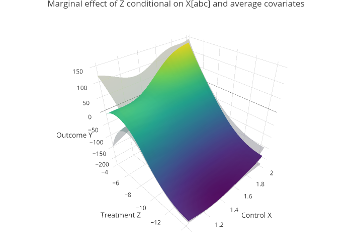

# GPspline
Package for a varying-coefficients spline regression with GP-regularization of the spline coefficients using a separate set of covariates. The method is designed to combine the predictive capabilities of black-box machine learning methods with the interpretative aspect of parametric models, especially with regards to binary and continuous causal effects.

## Installation
It can be installed using (requires appropriate c++ compilers, see the documentation of ```Rcpp```):
```
install.packages("https://github.com/mazphilip/GPspline/raw/master/builds/GPspline_0.1.4.tar.gz", repos = NULL, type = "source")
```
or using the ```devtools``` package:
```
install_github("mazphilip/GPspline")
```

## Theory
The intended use case is a (for now) single dimensional set of continuous variable(s) Z whose marginal (predictive/causal) effect we are interested. The other set, the control variables X or "confounders" for causal inference, are used to make the function approximation more accurate and for the causal effects control for confounding. Using Gaussian processes, we can use differentiable spline bases to obtain the marginal effect.

Formally,
```
y = mu + g(x) * b(z) + eps,
```
where each element of ```g``` has an independent GP-prior with covariance kernel ```K_g``` and zero prior-mean, ```b``` is a polynomial spline design vector (with dimension ```B```), and ```mu``` is the mean. The noise term ```eps``` is Gaussian with unknown variance ```sig^2```. As there is no useful basis extension for a binary (treatment) variable ```z```, the model reduces to my [CausalStump](https://github.com/mazphilip/CausalStump) method.

We can write the model in reduced form ```y = f(x,z) + eps``` with ```f ~ GP(mu, K_r)``` where the additive kernel is given by
```
K_r(i,j) = sum_{l=1}^B K_{g_l}(x_i,x_j) b_l(z_i) b_l(z_j).
```
This constitutes a proper kernel (sum of a product of kernels) and we can use standard Gaussian process inference methods to obtain the posterior distribution using empirical Bayes. Note that the spline knots are fixed in number and location.

## Example
```
library(GPspline)
set.seed(1234)
n2 = 300
X2 = matrix(runif(n2, min = 1, max = 2))
Z2 = rnorm(n2, exp(X2)-14, 1)
y2_true = as.matrix(72 + 3 * sqrt(X2) * ((Z2+8)^Sys.setenv("plotly_username"="your_plotly_username")2 - 2*Z2))
margy2_true = as.matrix(3 * sqrt(X2) * (2*(Z2+8) - 2))
Y2 = rnorm(n2, mean = y2_true, sd = 1)
my.GPS <- GPspline(Y2,X2,Z2,myoptim="GD",learning_rate = 0.0001,spline="ns",n.knots=1)
my.pred <- predict(my.GPS)
plot(Y2,my.pred$map); abline(0,1,lty=2)
plot(my.GPS,marginal=TRUE)
```



Interactive version: https://plot.ly/~mazphilip/1/
