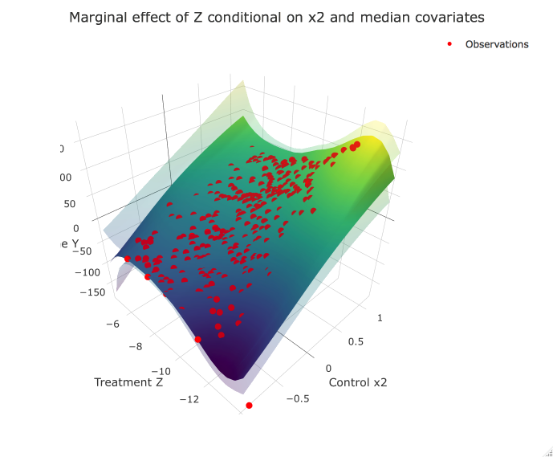

[](https://travis-ci.org/mazphilip/AdditiveCausalExpansion)

# ACE - Additive Causal Expansion Model
This is a package for a varying-coefficient regression with Gaussian process priors on the varying coefficients. The coefficient functions are dependent on the confounders. The linear elements are the basis expansion of the treatment variable, allowing for causal inference for continuous variables.

## Installation
It can be installed using (requires appropriate c++ compilers, see the documentation of ```Rcpp```):
```R
install.packages("https://github.com/mazphilip/AdditiveCausalExpansion/raw/master/builds/ace_0.4.1.tar.gz", repos = NULL, type = "source")
```
### Platforms
Generally, need to verify that Lapack and Arpack libraries are installed (required by Armadillo):

- Mac OS: Requires Lapack and Arpack with non-system ```g++``` compiler (llvm), for example using: https://github.com/coatless/r-macos-rtools
- Ubuntu 16.04: Requires manual installation of Arpack (and Lapack if not already installed)
```bash
sudo apt-get install libarpack2-dev libarpack++2-dev
sudo apt-get install liblapack-dev libblas-dev libatlas-base-dev 
```
* AWS Linux (+ RHEL & Fedora): Needs more testing
* Windows: Requires ```Rtools``` and manual installation of [Lapack](https://gcc.gnu.org/wiki/LAPACK%20on%20Windows) & [Arpack](http://www-bcf.usc.edu/~jbarbic/arpack.html) for MINGW (not fully tested)

## Theory
The intended use case is a (for now) single dimensional set of a continuous variable Z whose marginal causal effect we are interested in. The other set, the control/confounding variables X are used to adjust for the confounding (see Pearl . Using Gaussian processes, we can use differentiable spline bases to obtain the marginal effect. 

Formally,
```
y = mu + g(x) * b(z) + eps,
```
where each element of ```g``` has an independent GP-prior with covariance kernel ```K_g``` and zero prior-mean, ```b``` is a polynomial spline design vector (with dimension ```B```), and ```mu``` is the mean. The noise term ```eps``` is Gaussian with unknown variance ```sig^2```. As there is no useful basis extension for a binary (treatment) variable ```z```, the model reduces to my [CausalStump](https://github.com/mazphilip/CausalStump) method.

We can write the model in reduced form ```y = f(x,z) + eps``` with ```f ~ GP(mu, K_r)``` where the additive kernel is given by
```
K_r(i,j) = sum_{l=1}^B K_{g_l}(x_i,x_j) b_l(z_i) b_l(z_j).
```
This constitutes a proper covariance Mercer kernel (sum of a product of kernels) and we can use standard Gaussian process inference methods to obtain the posterior distribution, i.e. empirical Bayes. 

## Alternative implementations (schematic)
Here we sketch how the model can be implemented using other packages. For the prediction / learning steps we refer to the documentation of the used packages.

### Using GPs with `GPflow` in `Python`:
This implementation allows for non-Gaussian likelihoods, GPU-support, and automatic approximate inference! 
However, input normalization needs to be done manually.
```python
import gpflow as gp
from gpflow.kern import RBF, linear

# Define 
Gaussian = gp.likelihoods.Gaussian()
# assuming the treatment is the last dimension:
AceKernel = RBF(input_dim=nb_confounders, 
                active_dims=np.arange(0, nb_confounders), 
                ARD=True) \
            + RBF(input_dim=nb_confounders,
                  active_dims=np.arange(0, nb_confounders), 
                  ARD=True) \
            * Linear(input_dim=1, 
                     active_dims=[nb_confounders])
# Specify model:
AceModel = gp.models.GPR(Xtrain, Ytrain, 
                         kern=AceKernel, likelihood=Gaussian)
                         
# Variational inference can be done using the VGP model, 
# Sparse variational (i.e. with inducing points) with SVGP
          
# Training:
gp.train.AdamOptimizer(learning_rate).minimize(AceModel, maxiter=2000)

```

### Using cubic tensor-splines with `mgcv` in `R` (very similar):
This is a quick implementation for the ACE model. It uses more parameters when several confounders are present and is less efficient that the GP.
```R
library(mgcv)
# Note: fx determines whether the tensor spline is penalized (FASLE) or not (TRUE). 
# Since GPs constrain the functional space, we use recommend to use fx=FALSE
ace.formula <- y ~ te(list_confounders, bs = "cr", fx = FALSE) + te(list_confounders, bs = "cr", fx = FALSE, by = Trt)
model <- gam(data = data, formula = ace.formula)
```

## Example
```R
library(ace)
# generate data
set.seed(1234)
n2 <- 300
df <- data.frame(x = runif(n2, min = 1, max = 2))
df$x2 <- runif(n2, min = -1, max = 1)
df$z  <- rnorm(n2, exp(df$x) - 14, 1)
y_truefun <- function(x, z) {
    as.matrix(sqrt(x[, 1]) + x[, 2] * 3 * ((z + 8)^2 - 2 * z))
}
y2_true <- y_truefun(df[, c("x", "x2")], df$z)
df$y <- rnorm(n2, mean = y2_true, sd = 1)
# train model
my.ace <- ace(y ~ x + x2 | z, data = df, kernel="SE",
              basis = "cubic", n.knots = 2,
              optim = "Nadam", learning_rate = 0.01)
my.pred <- predict(my.ace)
plot(df$y, my.pred$map)
abline(0, 1, lty = 2)
# prediction of the curve as contour
plot(my.ace, "x2", show.observations = TRUE)
# prediction of the curve in 3D if plotly installed
plot(my.ace, "x2", plot3D = TRUE, show.observations = TRUE)

#difference to the true marginal curve
marg_truefun <- function(x, z) {
    as.matrix(sqrt(x[, 1]) + x[, 2] * 3 * (2 * (z + 8) - 2))
}
plot(my.ace, "x2", marginal = TRUE, show.observations = TRUE, truefun = marg_truefun)
```



Interactive version: https://plot.ly/~mazphilip/3/
